# 자료구조와 알고리즘 6주차 과제 - 문자열 정렬

- 1-1 다음 문자열이 주어졌을 때 LSD 문자열 정렬로
   정렬을 할 때 동작 과정을 각각 그려주세요.
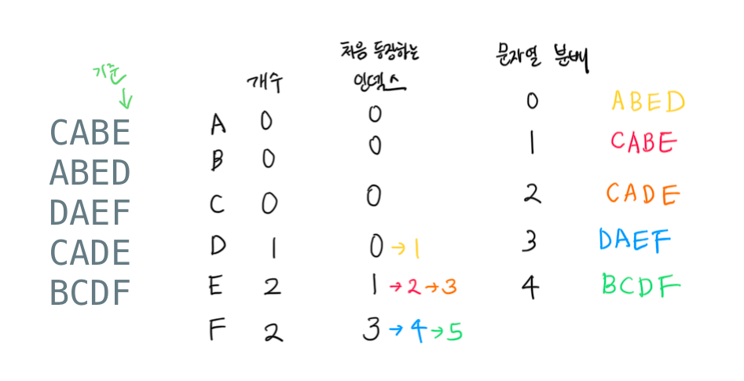

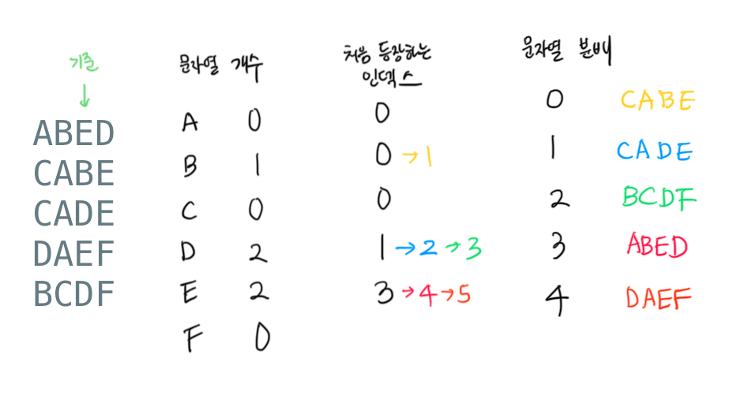

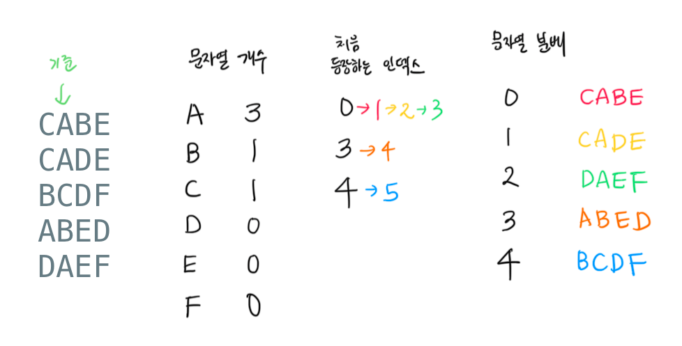

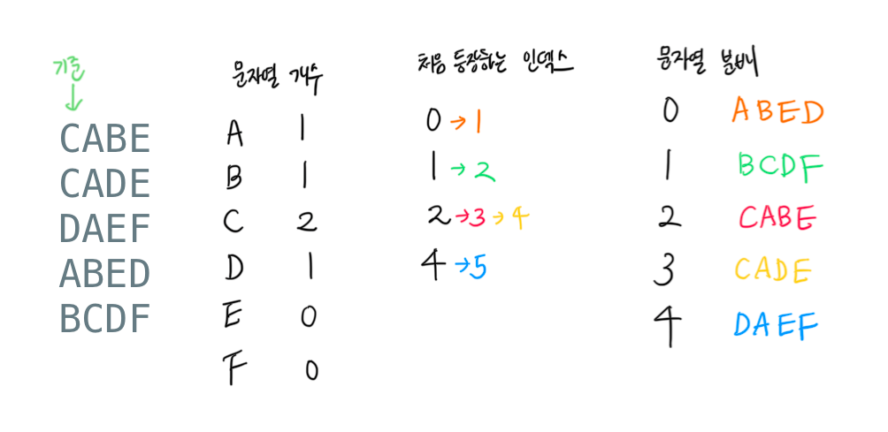

- 1-2 그다음에는 내가 직접 코드를 실행한다고 생각하면서 읽어 보세요. 아래
  데이터를 넣었을 때 실제로 실행되는 과정을 그림으로 그려주세요.
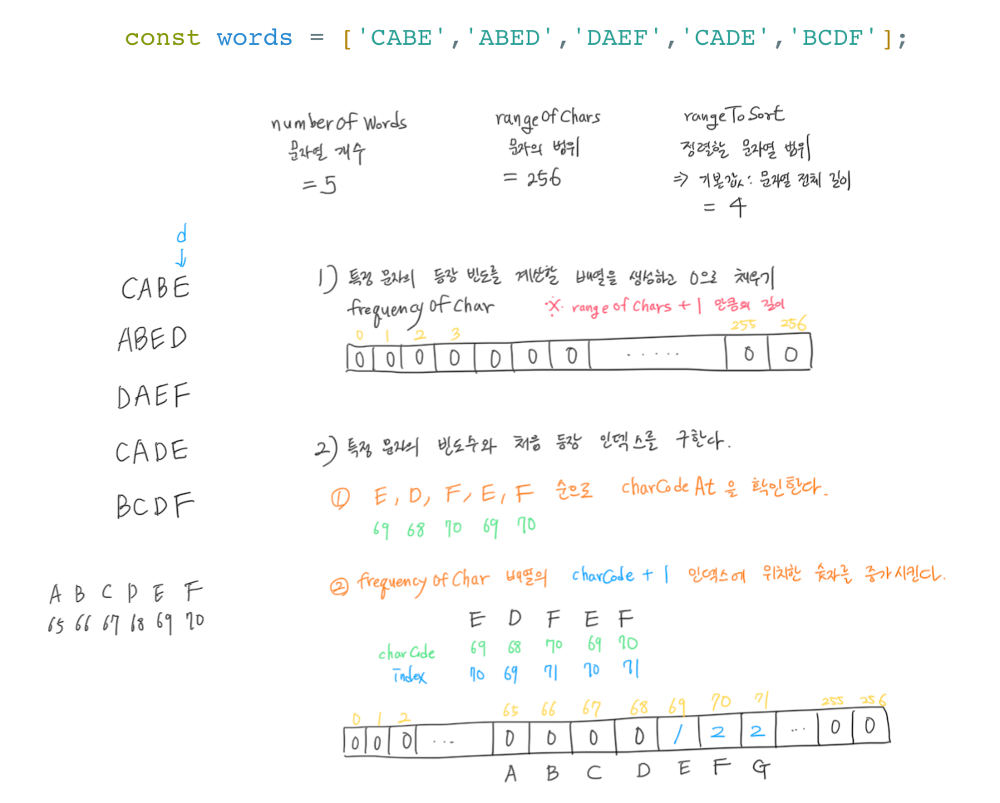

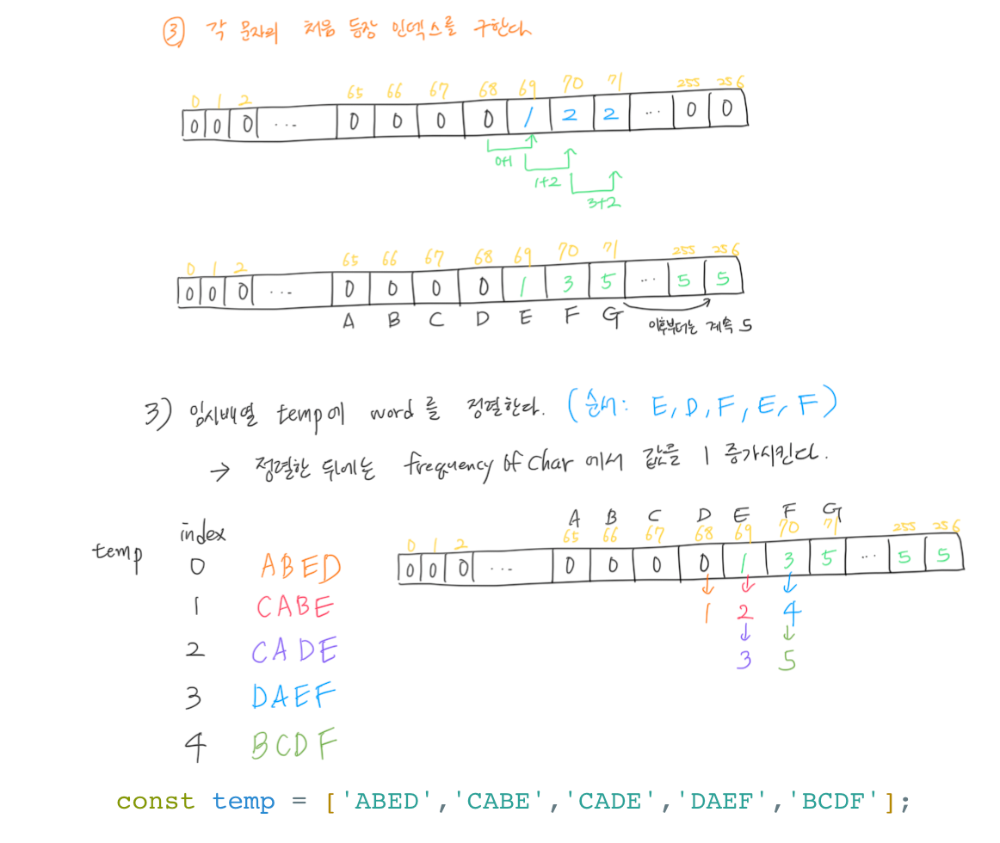

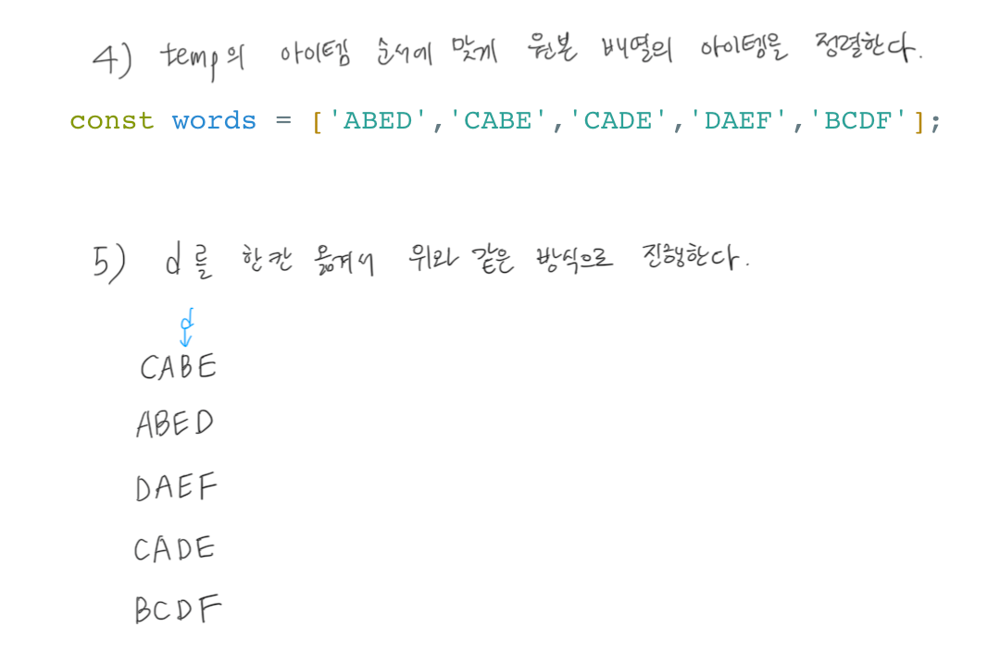

- 1-3 앞의 과정을 생각하면서 코드를 직접 구현해 주세요.

```
CABE
ABED
DAEF
CADE
BCDF
```

- 2-1다음 문자열이 주어졌을 때 MSD 문자열 정렬로
   정렬을 할 때 동작 과정을 각각 그려주세요
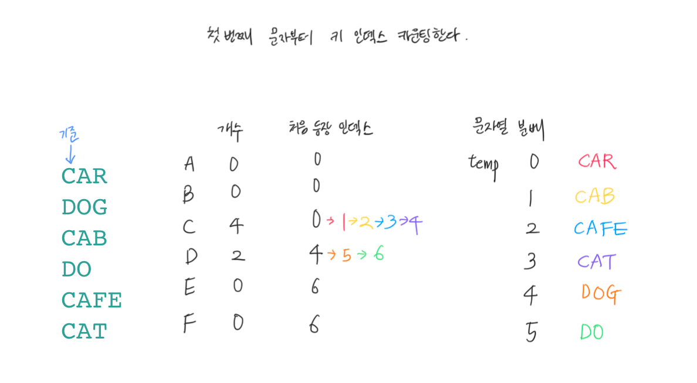

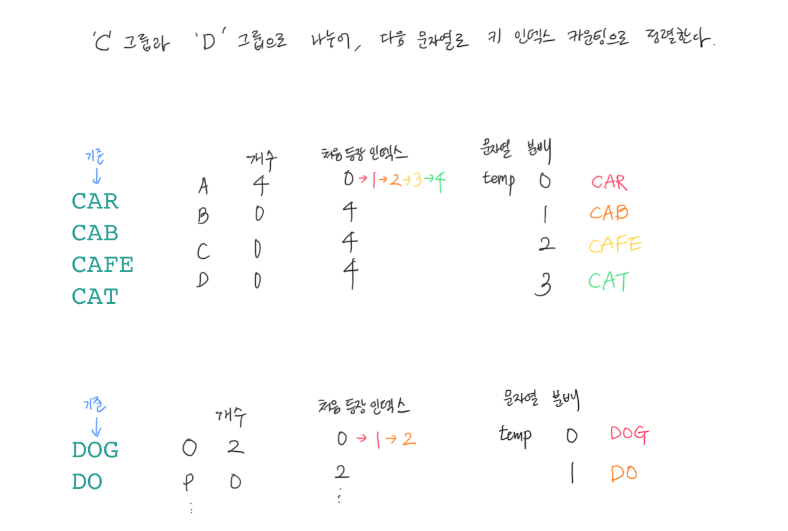

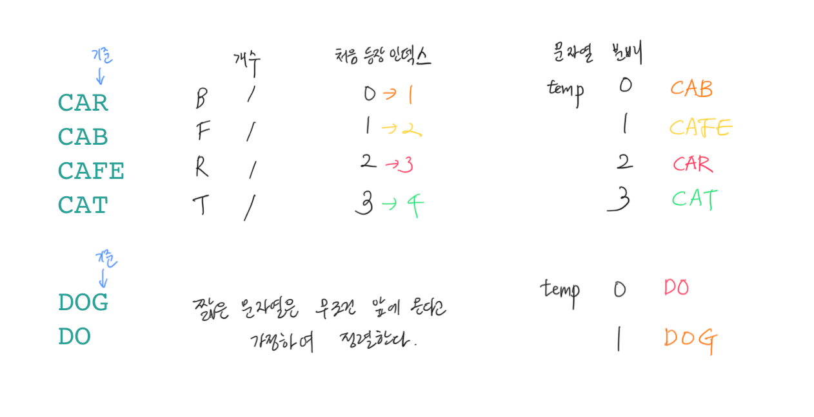

- 2-2 그다음에는 내가 직접 코드를 실행한다고 생각하면서 읽어 보세요. 아래
  데이터를 넣었을 때 실제로 실행되는 과정을 그림으로 그려주세요.

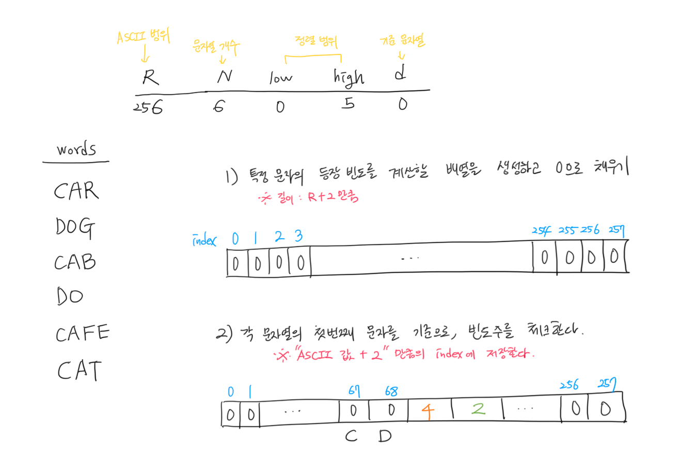

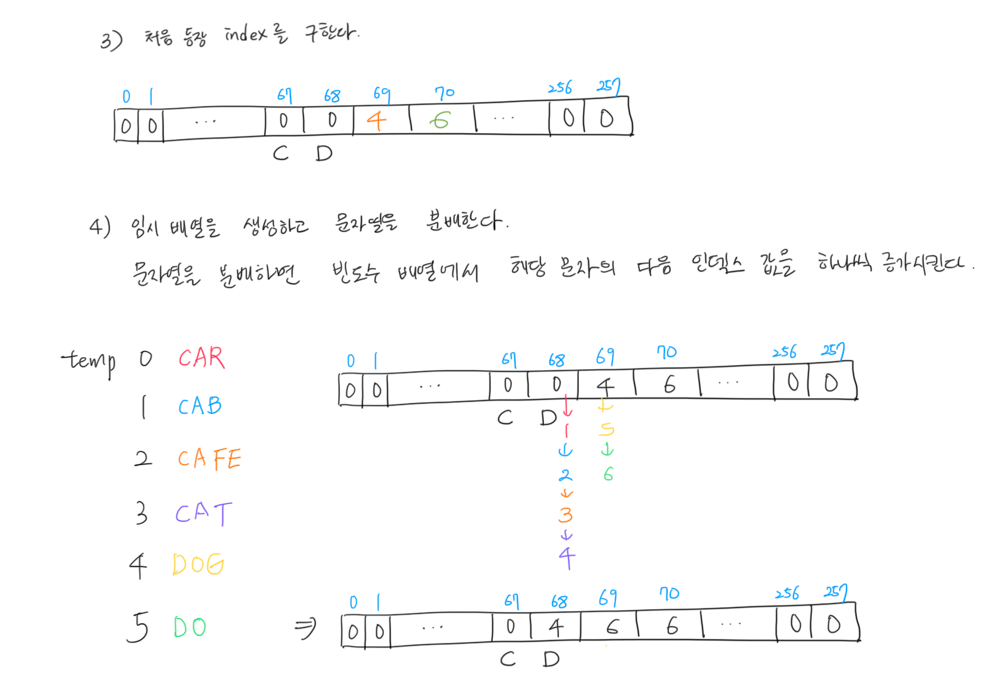

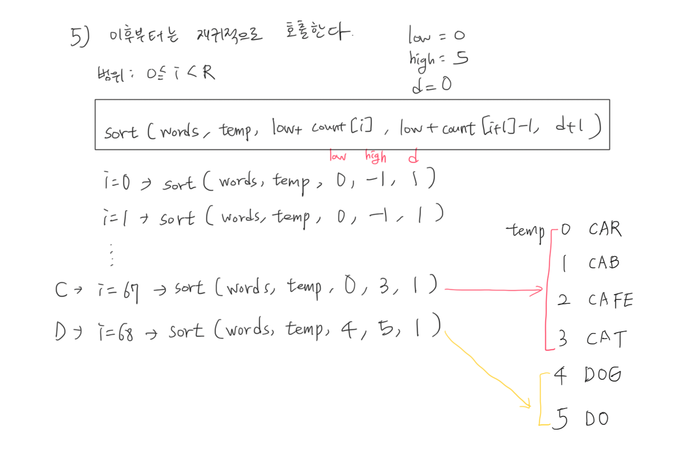


- 2-3 앞의 과정을 생각하면서 코드를 직접 구현해 주세요.

```
CAR
DOG
CAB
DO
CAFE
CAT
```

- 3-3 다음 문자열이 주어졌을 때 3-중 문자열 퀵정렬로 정렬을 할 때 동작 과정을 각각 그려주세요
- 3-2 그다음에는 내가 직접 코드를 실행한다고 생각하면서 읽어 보세요. 아래
  데이터를 넣었을 때 실제로 실행되는 과정을 그림으로 그려주세요.
- 3-3 앞의 과정을 생각하면서 코드를 직접 구현해 주세요.

```
BOAT
CAR
DOLL
BAT
DOG
CAT
DARE
CARE
BALL
```
